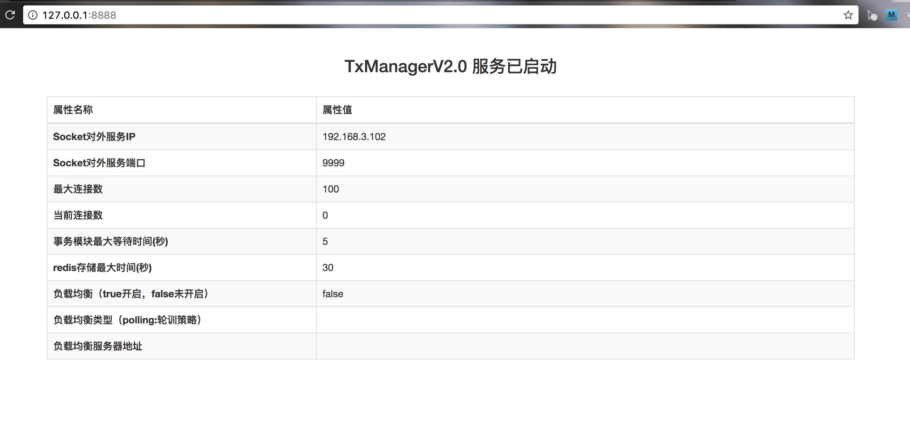

# TxManager
TxManager是LCN分布式事务框架的事务协调器，框架基于Netty做消息通讯，事务控制数据存储在Redis中。

原理向下找：LCN分布式事务框架的设计原理 标题。

## 使用教程
1. 启动redis服务，并配置redis.properties配置文件

```
#redis ip
redis.ip=127.0.0.1

#redis port
redis.port = 6379

#redis密码
#redis.auth=password
```
注意：密码需要时去掉添加即可。

2. 配置application.properties下的端口如下：

```
#服务端口
server.port=8888

spring.thymeleaf.prefix=classpath:/templates/
spring.thymeleaf.suffix=.html

```

3. 配置tx.properties配置

```

#本文可不配置，默认数据为transaction_wait_max_time=5 redis_save_max_time=30

#参与事务的最大等待时间（单位：秒） 所有参与分布式事务逻辑处理的最大等待时间
transaction_wait_max_time = 5

#存储到redis下的数据最大保存时间（单位：秒）
redis_save_max_time = 30

#socket server Socket对外服务端口
socket.port = 9999

#socket ip Socket对外服务IP (主要：必须是外网访问地址)
socket.ip = 192.168.3.102

# 最大socket连接数
socket.max.connection = 100

#开启负载均衡策略 true false
slb.on = false

#开启负载均衡必填项 服务器地址列表

#负载均衡类型 轮训策略:polling
slb.type = polling

#服务器地址列表  说明：中间用#分割(不能写本服务器，不然会出现死循环)端口是指服务端口非socket端口
slb.list = http://127.0.0.1:8889/#http://127.0.0.1:8810/

```

4. 配置完成后启动TxManagerApplication.main()方法，或者通过springboot打包运行。然后访问`http://127.0.0.1:8888`




# LCN分布式事务框架的设计原理

框架基于spring事务框架的基础之上做的再次封装，通过控制协调本地事务与全局事务的一致性从而达到分布式事务的效果。

特别说明：LCN框架 非TCC机制，非2PC机制 非3PC机制，原理详细说明请继续阅读。

## 事务操作步骤

1. 锁定事务单元（lock）
2. 确认事务模块状态(confirm)
3. 通知事务(notify)


## 锁定事务单元


我们假设方法A是分布式事务发起方法，A调用了B和C，B有调用了B1 B1有调用了B11和B12。如下图：


那么他们的流程为  
. 当执行A方法时，会先创建事务组。然后A将自己的事务单元添加到TxManager。此时A的业务方法会被调用。  
. B被执行，B也会将自己的事务单元添加到TxManager，然后执行B的业务单元。   
. B1被执行，B1也会将自己的事务单元添加到TxManager，然后执行B1的业务单元。  
. B11被执行，B11也会将自己的事务单元添加到TxManager，然后执行B11的业务单元，B11的业务执行完以后返回数据并通知TxManager事务单元状态，然后进入等待通知状态。  
. B12被执行，B12也会将自己的事务单元添加到TxManager，然后执行B12的业务单元，B12的业务执行完以后返回数据并通知TxManager事务单元状态，然后进入等待通知状态。  
. B1事务执行次完毕，通知TxManager事务单元状态，然后进入等待通知状态。  
. B事务执行次完毕，通知TxManager事务单元状态，然后进入等待通知状态。  
. C被执行，C也会将自己的事务单元添加到TxManager，然后执行C的业务单元，C的业务执行完以后返回数据并通知TxManager事务单元状态，然后进入等待通知状态。  
. A事务执行次完毕，通知TxManager事务单元状态，然后进入等待通知状态。  
. A发起通知TxManager第一阶段已经执行完毕。  

备注：LCN在处理事务的时候都将开启子线程处理事务，主线程返回业务数据，从而避免主线程堵塞。

## 确认事务模块状态

当A通知TxManager第一阶段已经执行完毕后，TxManager会检查事务单元模块是否都有效，若有效则进入通知确认阶段，否则直接进入第三阶段回滚事务。看似确认事务模块状态没有太大作用，其实主要用意是两点，1：确认与事务模块是否正常通讯，2：确认事务单元模块是否等待超时事务已经回滚。当事务单元接受到TxManager的事务单元模块确认通知以后，事务单元模块将不会自动回滚事务等待TxManager通知。


## 通知事务

当事务模块存在异常，那么在第一阶段时就能得知整个事务状态，然后直接通知各个事务单元事务回滚。此时即便事务没有收到通知，事务也会自动回滚。若事务都正常但在确认事务模块状态时，发现事务无法访问，则依旧会通知事务模块回滚，那么那些无法访问的模块由于没有接受到TxManager的任何指令也会自动回滚，那些已经被通知到事务单元模块会等待TxManager通知事务回滚。若都正常的情况下会通知事务全部提交。


技术交流群：554855843